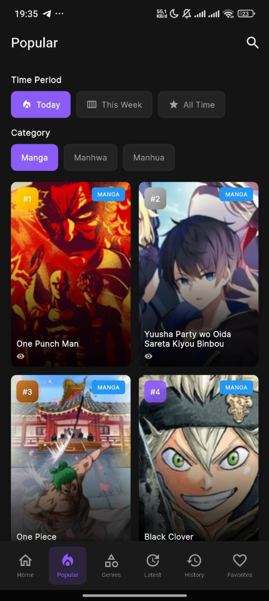
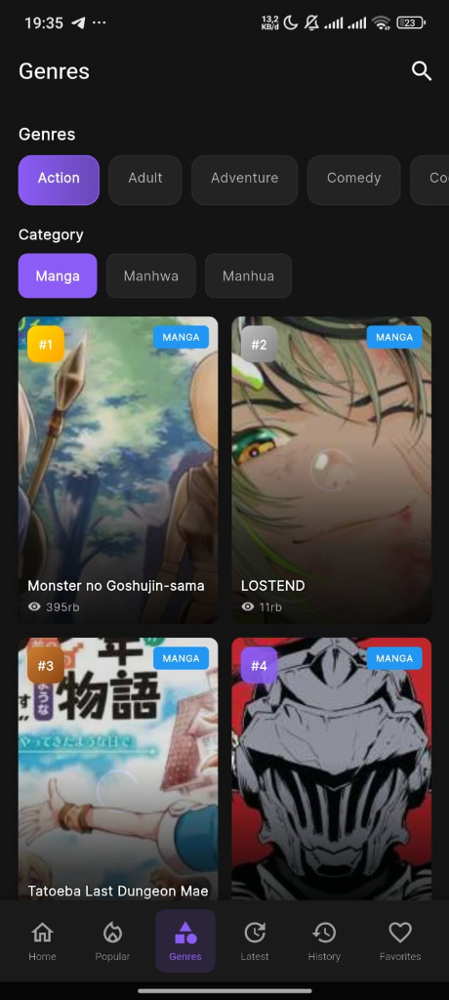
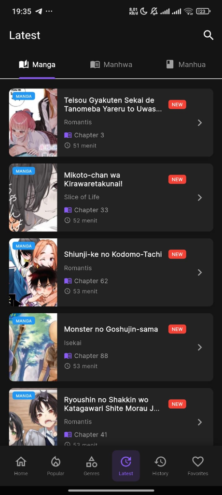

<p align="center">
  
</p>

<h1 align="center">📚 Komikkuya</h1>

<p align="center">
  <b>Baca Komik, Manga, Manhwa & Manhua Favoritmu — Gratis!</b>
</p>

<p align="center">
  
  
  
</p>

<p align="center">
  
</p>

---

## ✨ Tentang Komikkuya

**Komikkuya** adalah aplikasi mobile untuk membaca **Komik**, **Manga**, **Manhwa**, dan **Manhua** secara gratis. Nikmati ribuan judul dari berbagai genre dengan tampilan yang nyaman dan fitur yang lengkap.

> ⚠️ **Disclaimer**: Aplikasi ini mengakses konten dari sumber pihak ketiga. Kami tidak meng-host atau menyimpan konten apapun di server kami. Gunakan dengan bijak dan dukung kreator asli jika memungkinkan.

---

## 🚀 Fitur Utama

| Fitur | Deskripsi |
|-------|-----------|
| 🔍 **Pencarian Cepat** | Temukan judul favoritmu dengan mudah |
| 📖 **Multi-Source** | Baca dari berbagai sumber populer |
| 🌙 **Mode Gelap** | Nyaman dibaca kapanpun |
| 📥 **Bookmark & History** | Simpan progres bacaanmu |
| ⚡ **Performa Ringan** | Dioptimasi untuk pengalaman terbaik |
| 🔄 **Update Cepat** | Konten selalu fresh |

---

## 📱 Screenshot

<p align="center">
  
  
  
  
</p>

<p align="center">
  <b>Home</b> · <b>Popular</b> · <b>Genres</b> · <b>Latest</b>
</p>

---

## 📦 Download

Unduh versi terbaru dari halaman [**Releases**](https://github.com/Komikkuya/Komikkuya-mobile/releases):

| Platform | Download |
|----------|----------|
| 🤖 Android | [Download APK](https://github.com/Komikkuya/Komikkuya-mobile/releases/latest) |
| 🍎 iOS | [Download IPA](https://github.com/Komikkuya/Komikkuya-mobile/releases/latest) |

---

## 🛠️ Build dari Source

```bash
# Clone repository
git clone https://github.com/Komikkuya/Komikkuya-mobile.git
cd Komikkuya-mobile

# Install dependencies
flutter pub get

# Run aplikasi
flutter run

# Build APK
flutter build apk --release

# Build iOS (macOS only)
flutter build ios --release --no-codesign
```

---

## 🤝 Kontribusi

Kontribusi sangat diterima! Silakan buat **Pull Request** atau buka **Issue** untuk saran dan laporan bug.

---

## 📄 Lisensi

Project ini untuk tujuan edukasi. Semua konten yang ditampilkan adalah milik pemilik dan kreator aslinya.

---

<p align="center">
  Made with ❤️ by <b>Komikkuya Team</b>
</p>

<p align="center">
  ⭐ Star repo ini jika kamu suka!
</p>
